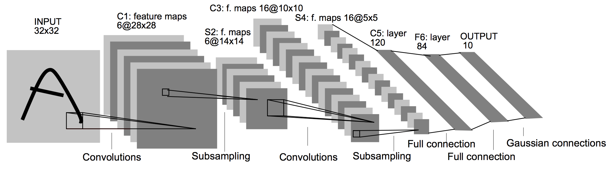
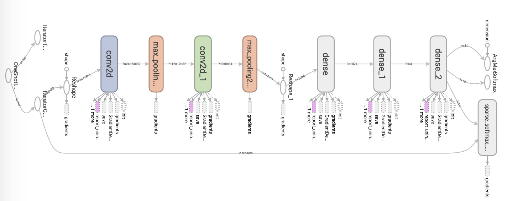

# Handwritten Digit Recognition in Noisy Scenarios
This repository contains necessary code to train a LeNet-5 for detecting handwritten digits from noisy images. 

Please read the [document](machine_learning_report.pdf "Tech report") for detailed descriptions.

## Introduction
This project is to build up a computer vision application and deep learning framework via `TensorFlow`. Specifically, we
- Implement LeNet-5 via TensorFlow
- Modify the LeNet-5 via cross-validation for an advanced performance.

## Architecture
The architecture of a LeNet-5 is:

We modify the LeNet-5 as follow:

## Results
Our models using classifical feature extraction and classifiers (not contained in this repository) achieves:

|        |   SVM  | Decision  Tree |   LDA  |   QDA  | Random  Forest |   XGB  |
|:------:|:------:|:--------------:|:------:|:------:|:--------------:|:------:|
|   RAW  | 77.07% |     80.84%     | 82.57% | 64.58% |     92.17%     | 91.98% |
|   PCA  | 91.75% |     77.61%     | 82.80% | 88.68% |     90.47%     | 90.15% |
|   HOG  | 92.56% |     79.70%     | 88.18% | 88.70% |     90.55%     | 92.31% |
| CORNER | 63.43% |     59.80%     | 59.97% | 10.32% |     82.97%     | 86.76% |

Compared to that, our trained LeNet-5 and modified version outperforms all above:

| LeNet-5 | Modified Lenet |
|:-------:|:--------------:|
|  93.76% |     95.03%     |

## Contact
If you have any questions towards code, please feel free to contact Jinmei Zheng at jmzhengkong@gmail.com.
